# SERVER_ANALYSIS.md

Live server analysis captured from deployed plugin JAR descriptors and local custom
plugin source.

## Scope

- VM: `minecraft-server`
- Zone: `asia-northeast3-a`
- Active network:
  - Velocity: `25565`
  - Survival Paper: `127.0.0.1:25566`, service `minecraft`
  - Lobby Paper: `127.0.0.1:25567`, service `lobby`
  - Newworld folder: `/opt/minecraft/dungeon`, service `newworld`, currently paused
- This report focuses on deployed plugins, commands, admin permissions, and plugin
  relationships.

## Active Plugin Inventory

### Survival

- `AdvancedEnchantments 9.23.0`
- `Citizens 2.0.42 build 4186`
- `EssentialsX 2.22.0-dev`
- `EssentialsXChat 2.22.0-dev`
- `EssentialsXSpawn 2.22.0-dev`
- `ItemsAdder 4.0.17`
- `LeeSeolAuction 0.1.0`
- `LeeSeolCleanup 0.1.0`
- `LeeSeolCombat 0.1.0`
- `LeeSeolCore 0.1.0`
- `LeeSeolDungeon 0.1.0`
- `LeeSeolEconomy 0.1.0`
- `LeeSeolHologram 0.1.0`
- `LeeSeolRanks 0.1.0`
- `LeeSeolTown 0.1.0`
- `LuckPerms 5.5.53`
- `PlaceholderAPI 2.12.2`
- `ProtocolLib 5.5.0 snapshot`
- `TAB 6.0.2`
- `Vault 1.7.3-b131`

### Lobby

- `ItemsAdder 4.0.17`
- `LeeSeolAuction 0.1.0`
- `LeeSeolCore 0.1.0`
- `LeeSeolEconomy 0.1.0`
- `LeeSeolHologram 0.1.0`
- `LeeSeolLobby 0.1.0`
- `LeeSeolRanks 0.1.0`
- `LeeSeolTown 0.1.0`
- `LuckPerms 5.5.53`
- `PlaceholderAPI 2.12.2`
- `ProtocolLib 5.5.0 snapshot`
- `TAB 6.0.2`
- `Vault 1.7.3-b131`
- `WorldEdit 7.4.3`

### Velocity

- `LeeSeolProxy 0.1.0`

### Newworld Paused Folder

`/opt/minecraft/dungeon/plugins` is intentionally empty. Old plugin copies were moved
to `/opt/minecraft/dungeon/plugins.disabled/` so `newworld` cannot accidentally start
with stale survival/lobby behavior. If New World development resumes, choose its
plugin set explicitly before enabling the service.

## Custom Plugin Features

| Plugin | Main Function |
| --- | --- |
| `LeeSeolProxy` | Velocity-side `/lobby`, `/survival`, `/servers` movement commands. |
| `LeeSeolCore` | Server info, config reload, launch pads, portal triggers, dimension gate restrictions, Paper-to-Velocity movement messaging. |
| `LeeSeolEconomy` | Won economy, Vault economy provider, shop GUI, NPC shop helpers, Shift+F server menu. |
| `LeeSeolAuction` | User item submission, admin-selected auction lots, bid GUI, admin-opened/closed auction flow, Vault settlement. |
| `LeeSeolDungeon` | Internal survival `dungeon` world, dungeon entry/exit, portal regions, block protection, random loot chest spots/tables. |
| `LeeSeolLobby` | Lobby spawn control, build/gamemode/protection rules. |
| `LeeSeolTown` | Town/village membership, nation/federation upgrade, claims, town/nation chat, affiliation prefixes. |
| `LeeSeolHologram` | In-game RGB hologram creation/editing through commands. |
| `LeeSeolCombat` | Combat tag, combat logout corpse/clone handling, corpse drops. |
| `LeeSeolCleanup` | Periodic dropped-item cleanup and cleanup timer status. |
| `LeeSeolRanks` | Shared lobby/survival rank data, one-rank permission sync, PlaceholderAPI rank prefix/image placeholders. |

## Custom Commands

### Velocity

- `/lobby`, alias `/hub`: move to lobby backend.
- `/survival`, alias `/wild`: move to survival backend.
- `/servers`, aliases `/serverlist`, `/network`: show registered backend servers.

### LeeSeolCore

- `/serverinfo`: simple server info.
- `/leeseolcore reload`, `/lscore reload`: reload core config.
- `/leeseolcore launchpad set <id> [forward] [upward] [cooldownSeconds]`
- `/leeseolcore launchpad list`
- `/leeseolcore launchpad remove <id>`
- `/leeseolcore portal pos1`
- `/leeseolcore portal pos2`
- `/leeseolcore portal create <id> <targetServer> [cooldownSeconds]`
- `/leeseolcore portal list`
- `/leeseolcore portal remove <id>`

### LeeSeolEconomy

- `/won`: show own balance.
- `/won balance|bal|money [player]`: show balance.
- `/won pay <player> <amount>`: send money.
- `/won give <player> <amount>`: admin deposit.
- `/won take <player> <amount>`: admin withdraw.
- `/won set <player> <amount>`: admin set balance.
- `/won reload`: admin reload.
- `/shop [shop]`: open shop GUI.
- `/wonnpc create <id> <shopId> [skin:<playerName>] [displayName]`
- `/wonnpc skin <id> <playerName|none>`
- `/wonnpc remove <id>`
- `/wonnpc list`
- `/servermenu`: open Shift+F server movement menu.

### LeeSeolAuction

- `/auction`, aliases `/ah`, `/auc`: open auction GUI.
- `/auction submit`: open item submission GUI.
- `/auction admin`: admin lot selection GUI.
- `/auction open <lot> [seconds]`: admin start auction.
- `/auction increment|setincrement <amount>`: admin set bid increment.
- `/auction end`: admin end auction and settle winner.
- `/auction reload`: admin reload config.

### LeeSeolDungeon

- `/dungeon reload`
- `/dungeon enter`
- `/dungeon exit`
- `/dungeon portal pos1`
- `/dungeon portal pos2`
- `/dungeon portal create <id> <targetWorld|return> [cooldownSeconds]`
- `/dungeon portal list`
- `/dungeon portal remove <id>`
- `/dungeon chest table <tableId>`
- `/dungeon chest addspot <id> <tableId> [chance] [respawnSeconds]`
- `/dungeon chest list`
- `/dungeon chest spawn <id>`
- `/dungeon chest roll`
- `/dungeon chest removespot <id>`

### LeeSeolLobby

- `/lobbysetspawn`: set fixed lobby spawn.

### LeeSeolTown

- `/town`, aliases `/party`, `/village`, `/towny`
- `/party create <name>`
- `/party invite <player>`
- `/party accept <party>`
- `/party deny <party>`
- `/party join <party>`
- `/party leave`
- `/party transfer <player>`
- `/party kick <player>`
- `/party claim`
- `/party unclaim`
- `/party info [party]`
- `/party me`, `/party status`, `/party 소속`
- `/party chat <global|party|nation>`
- `/party nation create <name> <republic|empire> [party...]`
- `/party nation disband`
- `/party nation pvp <on|off>`
- `/party nation build <on|off>`
- `/party federation create <name> <party1> [party2] [party3] [...]`
- `/party federation disband`
- `/party reload`
- `/tc [message]`, alias `/pc`: town/party chat.
- `/nc [message]`: nation chat.

### LeeSeolHologram

- `/holo`, aliases `/hologram`, `/lholo`
- `/holo create <id> [text]`
- `/holo delete <id>`
- `/holo movehere <id>`
- `/holo addline <id> <text>`
- `/holo setline <id> <line> <text>`
- `/holo insertline <id> <line> <text>`
- `/holo removeline <id> <line>`
- `/holo spacing <id> <value>`
- `/holo info <id>`
- `/holo list`
- `/holo reload`

### LeeSeolCombat

- `/leeseolcombat`, alias `/combat`
- `/combat status`
- `/combat reload`
- `/combat force <user1> <user2>`
- `/combat spectatorclone <on|off>`

### LeeSeolCleanup

- `/leeseolcleanup`, aliases `/cleanup`, `/itemcleanup`
- `/cleanup status`
- `/cleanup run`
- `/cleanup reload`

### LeeSeolRanks

- `/rank [player|up]`, alias `/ranks`
- `/rankup`: rank up when conditions are met.
- `/leeseolrank status`, alias `/lsrank status`
- `/leeseolrank reload`
- `/leeseolrank set <player> <PLAYER|D|C|B|A|S|ADMIN|DEV>`
- `/leeseolrank dev <player> <on|off>`

## External Plugin Commands

### EssentialsX

Core command set includes:

`afk`, `anvil`, `back`, `balance`, `balancetop`, `ban`, `banip`, `book`, `break`,
`broadcast`, `burn`, `clearinventory`, `condense`, `delhome`, `deljail`, `delkit`,
`delwarp`, `disposal`, `eco`, `enchant`, `enderchest`, `essentials`, `exp`, `feed`,
`fly`, `gamemode`, `gc`, `getpos`, `give`, `god`, `hat`, `heal`, `help`, `home`,
`ignore`, `info`, `invsee`, `item`, `itemlore`, `itemname`, `jails`, `kick`,
`kickall`, `kit`, `kill`, `list`, `mail`, `me`, `more`, `motd`, `msg`, `mute`,
`near`, `nick`, `pay`, `paytoggle`, `ping`, `playtime`, `r`, `realname`, `repair`,
`rules`, `seen`, `sell`, `sethome`, `setjail`, `setwarp`, `setworth`, `spawnmob`,
`speed`, `sudo`, `suicide`, `tempban`, `time`, `togglejail`, `tp`, `tpa`,
`tpaccept`, `tpahere`, `tpdeny`, `tphere`, `tppos`, `tpr`, `unban`, `vanish`,
`warp`, `weather`, `whois`, `workbench`, `world`, `worth`.

Additional Essentials modules:

- `EssentialsChat`: `/toggleshout`
- `EssentialsSpawn`: `/spawn`, `/setspawn`

### AdvancedEnchantments

- `/AdvancedEnchantments`
- Main admin/user permissions are under `ae.*`, including `ae.admin`, `ae.reload`,
  `ae.givebook`, `ae.giveitem`, `ae.enchant`, `ae.gkits`, `ae.open`, `ae.market`.

### Citizens

- `/npc`
- `/trait`
- `/citizens`
- `/template`
- `/waypoints`

### ItemsAdder

- `/ia`, `/iareload`, `/iazip`, `/iaget`, `/iagive`, `/iadrop`, `/iaremove`,
  `/iatexture`, `/iablock`, `/iarecipe`, `/iaimage`, `/iahud`, `/iainfo`,
  `/iahitbox`, `/iaconfig`, `/iaentity`, `/iadebug`, `/iaitem`, `/crops`
- Lobby self-hosts resource pack on port `8163`.
- Survival uses external-host URL from lobby and auto-applies it.

### TAB

- `/tab`
- Major admin permissions include `tab.admin`, `tab.reload`, `tab.parse`,
  `tab.groupinfo`, `tab.grouplist`, `tab.scoreboard.*`, `tab.nametag.*`,
  `tab.bossbar.*`, `tab.staff`, `tab.bypass`.

### LuckPerms

- `/luckperms`, commonly `/lp`
- Permission data is MariaDB-backed. Prefer console/plugin sync over direct DB edits.

### PlaceholderAPI

- `/placeholderapi`, commonly `/papi`
- Used by TAB and custom plugins for dynamic text.

### ProtocolLib

- `/protocol`
- `/packet`
- `/filter`
- `/packetlog`

### Vault

- `/vault-info`
- `/vault-convert`

### WorldEdit

- Installed on lobby. Commands are registered dynamically and were not listed in the
  simple descriptor extraction, but WorldEdit selection is used by `LeeSeolCore`
  portal creation.

## Admin And Bypass Permissions

### Custom Admin Permissions

- `leeseolcore.admin`: LeeSeolCore reload, launchpad, portal admin.
- `leeseoleconomy.admin`: won admin, NPC shop admin, economy reload.
- `leeseolauction.admin`: auction open/end/reload and admin lot selection.
- `leeseoldungeon.admin`: dungeon portal/chest admin.
- `leeseollobby.admin`: lobby spawn/protection admin.
- `leeseoltown.admin`: town/nation/federation admin overrides and reload.
- `leeseolhologram.admin`: hologram create/edit/delete/reload.
- `leeseolcombat.admin`: combat status/reload/force/spectator clone admin.
- `leeseolcleanup.admin`: cleanup status/run/reload.
- `leeseolranks.admin`: rank management and LuckPerms rank sync.

### Custom Bypass / Special Permissions

- `leeseolcore.dimension.bypass`: bypass dimension gate restrictions.
- `leeseoldungeon.bypass`: bypass dungeon protection.
- `leeseoldungeon.menu-bypass`: use server menu inside restricted dungeon worlds.
- `leeseolauction.world-bypass`: use auction in blocked worlds such as dungeon.
- `leeseolcombat.bypass`: bypass combat tag/logout clone rules.
- `leeseollobby.bypass`: bypass lobby build/gamemode protection.
- `leeseolranks.dev`: DEV-specific permission.
- Rank permissions:
  - `leeseolranks.rank.player`
  - `leeseolranks.rank.d`
  - `leeseolranks.rank.c`
  - `leeseolranks.rank.b`
  - `leeseolranks.rank.a`
  - `leeseolranks.rank.s`
  - `leeseolranks.rank.admin`
  - `leeseolranks.rank.dev`

### User Permissions

- `leeseoleconomy.shop`: open shop GUI.
- `leeseoleconomy.pay`: pay another player.
- `leeseoleconomy.servermenu`: open Shift+F server menu.
- `leeseolauction.use`: open auction GUI and bid.
- `leeseolauction.submit`: submit auction items.
- `leeseoltown.use`: use basic town commands.
- `leeseoltown.claim`: claim chunks.
- `leeseoltown.chat`: use town/nation chat.
- `leeseoldungeon.use`: use dungeon features.

### External Admin Permissions

- `ae.admin`, `ae.reload`, `ae.givebook`, `ae.giveitem`, `ae.enchant`,
  `ae.gkits`, `ae.open`, `ae.market`, and other `ae.*` permissions.
- `tab.admin`, `tab.reload`, `tab.parse`, `tab.groupinfo`, `tab.grouplist`,
  `tab.scoreboard.*`, `tab.nametag.*`, `tab.bossbar.*`, `tab.staff`, `tab.bypass`.
- `protocol.admin`, `protocol.info`.
- `vault.admin`.
- Essentials exposes many command permissions dynamically; plugin descriptor explicitly
  showed `essentials.gamemode.spectator` as op-default.

## Plugin Connection Structure

```mermaid
flowchart LR
  Velocity["Velocity Proxy"] --> Proxy["LeeSeolProxy"]
  Velocity --> CorePortal["LeeSeolCore portal movement"]
  Velocity --> EconMenu["LeeSeolEconomy server menu"]

  LuckPerms["LuckPerms + MariaDB"] --> Ranks["LeeSeolRanks"]
  Ranks --> PAPI["PlaceholderAPI"]
  Town["LeeSeolTown"] --> PAPI
  Cleanup["LeeSeolCleanup"] --> PAPI
  PAPI --> TAB["TAB"]
  PAPI --> Chat["LeeSeolTown chat format"]

  ItemsAdder["ItemsAdder Resource Pack"] --> RankImages["BetterRanks rank images"]
  RankImages --> TAB
  RankImages --> Chat

  Vault["Vault"] --> Economy["LeeSeolEconomy"]
  Vault --> Auction["LeeSeolAuction"]
  Vault --> Essentials["EssentialsX"]
  Economy --> Auction
  Economy --> Town

  Citizens["Citizens"] --> Combat["LeeSeolCombat"]
  Citizens --> NpcShop["LeeSeolEconomy NPC shops"]

  Dungeon["LeeSeolDungeon internal dungeon"] --> AuctionBlock["Auction blocked in dungeon"]
  Dungeon --> MenuBlock["Server menu blocked in dungeon"]
  Dungeon --> Cleanup

  WorldEdit["WorldEdit lobby"] --> CorePortal
```

## Important Couplings And Risk Points

- `LeeSeolRanks`, `LeeSeolTown`, `TAB`, `PlaceholderAPI`, and `ItemsAdder` are tightly
  coupled for rank/nation/name display. Changing one can affect tab list and chat.
- `ItemsAdder` resource pack is hosted by lobby and consumed by survival. If lobby
  self-host or port `8163` fails, survival rank images can break.
- `LeeSeolEconomy` is the central economy provider through Vault; shops, auctions, and
  town costs can all be affected by money changes.
- `LeeSeolAuction` depends on Vault and is world-restricted by dungeon rules.
- `LeeSeolDungeon` is internal to survival. It should not be treated as a Velocity
  backend.
- `LeeSeolCombat` depends on Citizens. Citizens issues can break logout corpse/clone
  behavior.
- EssentialsChat and `LeeSeolTown` both affect chat presentation. Chat format changes
  should be verified in-game.
- `newworld` is paused and its active plugin folder is empty. Files in
  `plugins.disabled` are not active, but should be audited before reuse.

## Current Rank State

Shared rank data currently contains only:

- `lee_seol`: `ADMIN`
- `YamiyongO_o`: `DEV`

The rank system is intended to keep one active LeeSeolRanks rank per user.
